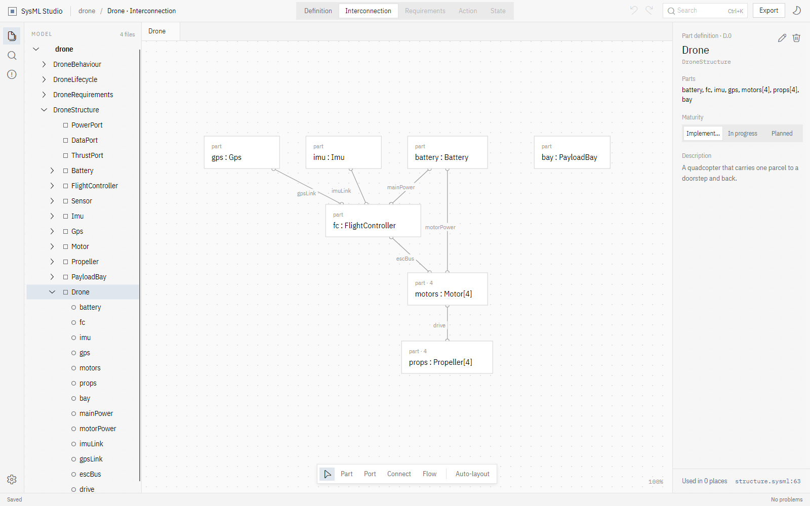
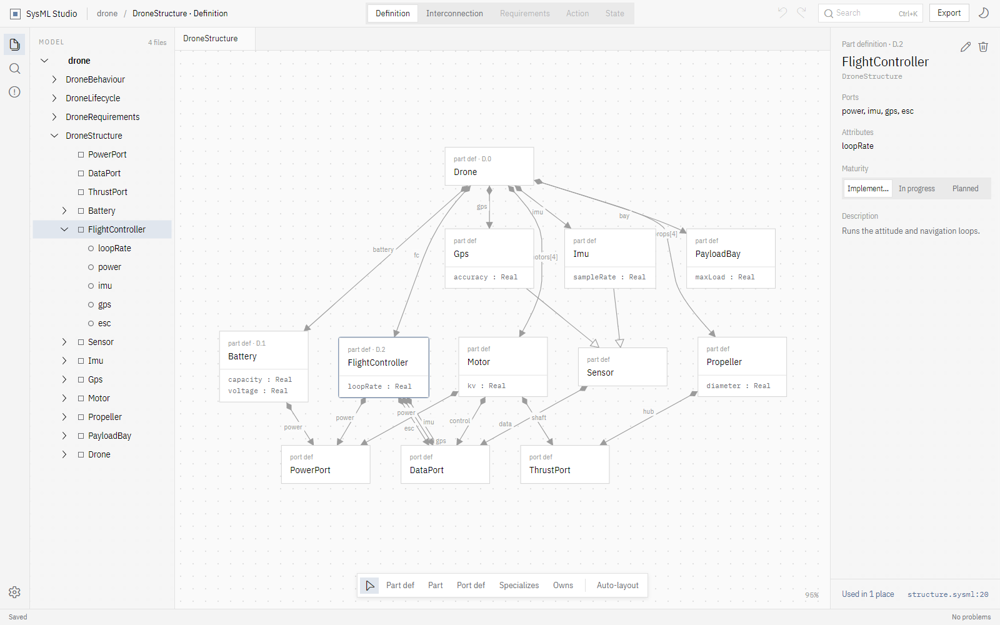
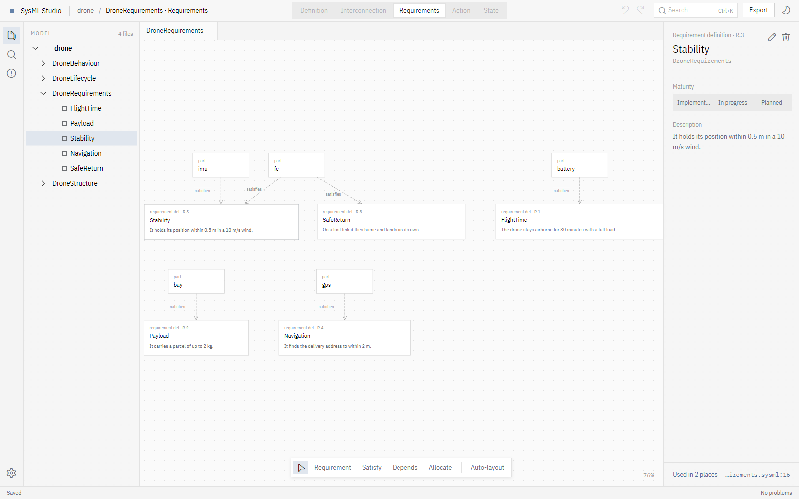
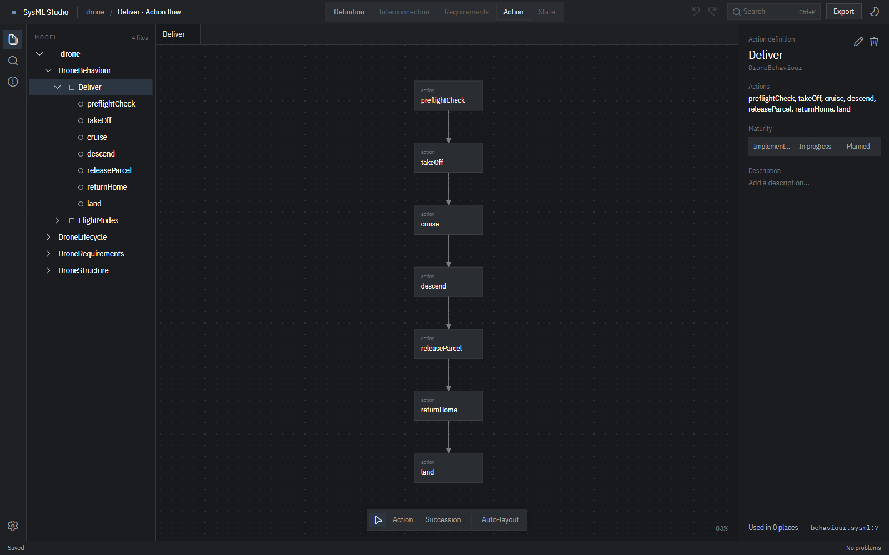
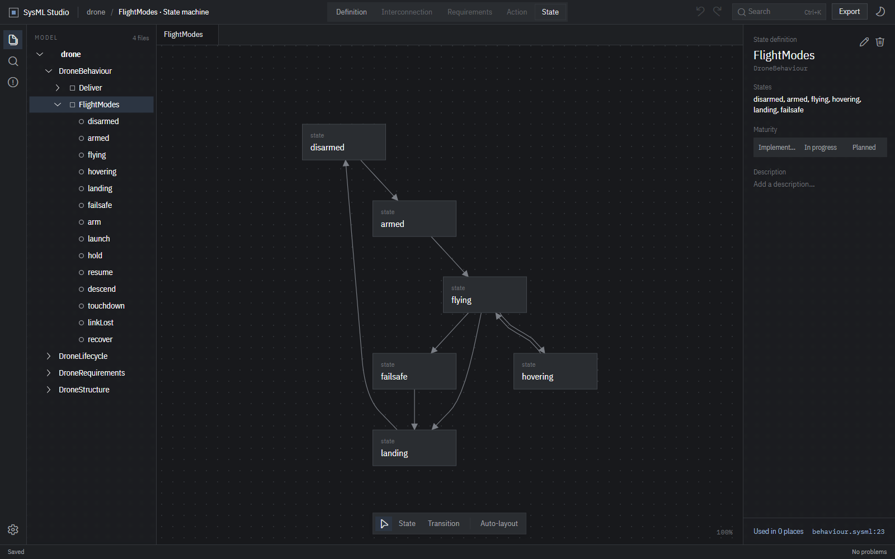
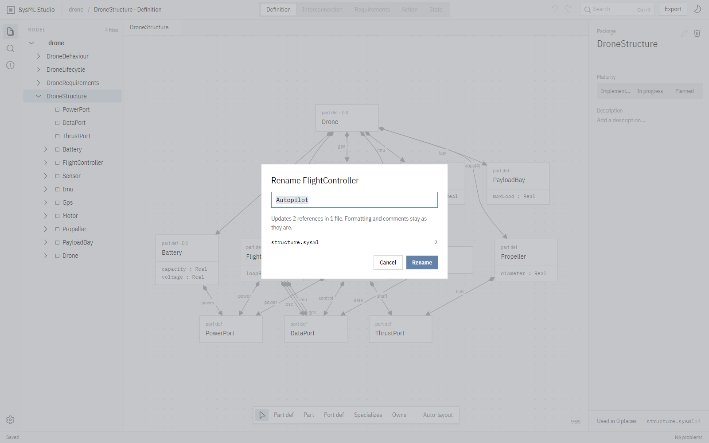
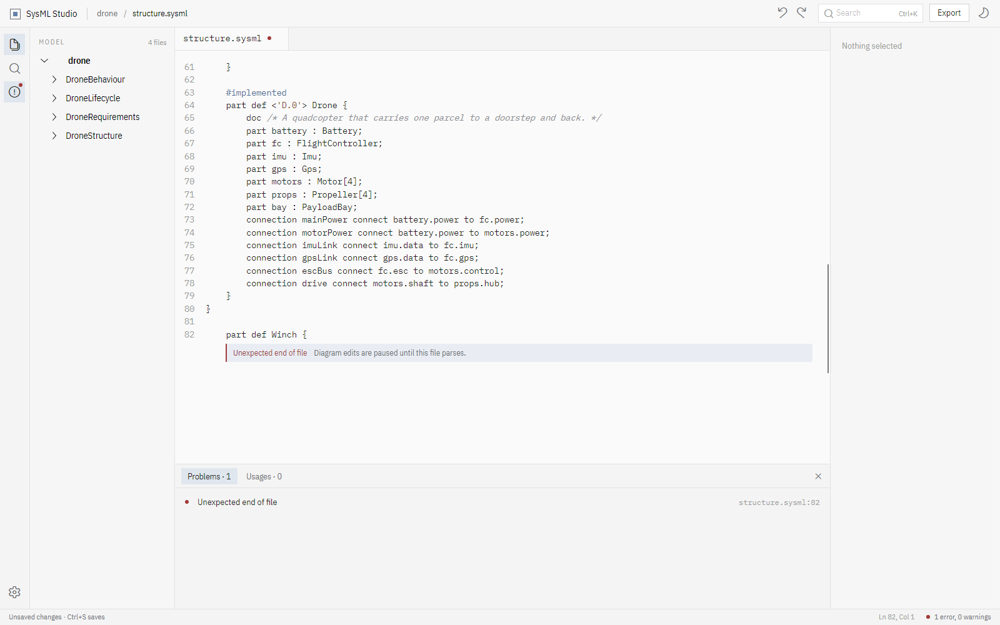

<h1 align="center">SysML Studio</h1>

<p align="center">
  <strong>Draw your model. Keep your text.</strong><br>
  A graphical viewer and editor for SysML v2 models in the textual notation,<br>
  with the <code>.sysml</code> files themselves as the source of truth.
</p>

<p align="center">
  <a href="https://github.com/SetZero/sysml-studio/actions/workflows/ci.yml"></a>
  
  
  
  <a href="https://github.com/SetZero/sysml-studio/releases/latest"></a>
  <a href="LICENSE"></a>
</p>

<p align="center">
  <a href="https://setzero.github.io/sysml-studio/"><b>Website</b></a> ·
  <a href="#download"><b>Download</b></a> ·
  <a href="#diagrams"><b>Diagrams</b></a> ·
  <a href="#development"><b>Development</b></a>
</p>

<picture>
  <source media="(prefers-color-scheme: dark)" srcset="docs/images/interconnection-dark.png">
  
</picture>

Open a folder of `.sysml` files, browse the model as a tree, read it as
diagrams, change it, and save. Saving writes a minimal patch over the text, so
comments, doc blocks and formatting survive an edit and a diff shows only what
actually changed. It is the Enterprise Architect idea, on .NET, cross-platform,
without a project database.

## Download

Get the [latest release](https://github.com/SetZero/sysml-studio/releases/latest).
Nothing else needs to be installed, and a sample model comes with it.

| System | Package |
|---|---|
| Windows | [x64](https://github.com/SetZero/sysml-studio/releases/latest/download/SysML-Studio-windows-x64.zip) · [ARM64](https://github.com/SetZero/sysml-studio/releases/latest/download/SysML-Studio-windows-arm64.zip) — unzip and run `SysML Studio.exe` |
| macOS | [Apple silicon](https://github.com/SetZero/sysml-studio/releases/latest/download/SysML-Studio-macos-arm64.zip) · [Intel](https://github.com/SetZero/sysml-studio/releases/latest/download/SysML-Studio-macos-x64.zip) — unzip, move to Applications, right-click → *Open* the first time |
| Debian, Ubuntu | [amd64](https://github.com/SetZero/sysml-studio/releases/latest/download/sysml-studio_amd64.deb) · [arm64](https://github.com/SetZero/sysml-studio/releases/latest/download/sysml-studio_arm64.deb) — `sudo apt install ./sysml-studio_amd64.deb` |
| Other Linux | [x64](https://github.com/SetZero/sysml-studio/releases/latest/download/SysML-Studio-linux-x64.tar.gz) · [ARM64](https://github.com/SetZero/sysml-studio/releases/latest/download/SysML-Studio-linux-arm64.tar.gz) — unpack and run `sysml-studio/sysml-studio` |

The builds are not code-signed yet, so Windows and macOS ask once before
they open it.

## Why SysML Studio

- **Lossless edits.** An edit rewrites only the tokens it has to. Comments,
  `doc` blocks, blank lines and your formatting stay as they are.
- **Nothing to import.** Point it at a folder. Every file is parsed with the
  SysML v2 grammar and names resolve across files.
- **Works with git.** No binary model, no database. Branch, review and merge
  models the way you already work with code, and keep editing them in any
  text editor too.
- **Standard formats out.** Export the whole workspace as SysML v2 JSON or
  XMI, and any diagram as SVG or PNG.

## Diagrams

Select an element and the switcher in the title bar offers the diagrams it can
be drawn as. Boxes are laid out automatically, kept apart, with edges routed
around them; drag anything where you want it.

| Definition | Interconnection |
|---|---|
|  |  |
| Part, port, action and requirement definitions with their features; composition, specialization and typing. | The parts inside a definition and the connections and flows between their ports. |

| Requirements | Action | State |
|---|---|---|
|  |  |  |
| Requirements with ids and text, and the parts that satisfy them. | The steps of an action and the successions between them. | States and the transitions between them. |

## Editing

Right-click an element — in the tree or on a diagram — to add inside it,
rename it, type it, mark its maturity or delete it. Each dialog says what it
will change before it writes. The toolbar under a diagram adds elements and
draws relations between two clicked boxes: connect, flow, succession,
transition, satisfy, dependency, allocate, specialization and composition.



That rename touches exactly two lines:

```diff
     #implemented
-    part def <'D.2'> FlightController {
+    part def <'D.2'> Autopilot {
         doc /* Runs the attitude and navigation loops. */
 …
-        part fc : FlightController;
+        part fc : Autopilot;
```

Every edit is a patch over the text, re-parsed before it is accepted, kept in
memory with undo until Save writes the changed files. Source tabs show the
text itself; errors appear inline and in the problems list, and diagram edits
wait until the file parses again.



Nearly every command has a keyboard shortcut; the cogwheel at the bottom left
opens the settings, where each one can be changed (click it, press the new
keys) and the theme chosen. They are kept in `settings.json` in the user's
application data.

## Build from source

Needs the .NET 10 SDK and a JDK (ANTLR generates the parser at build time;
`Antlr4BuildTasks` downloads a JDK if there is none).

```
git clone https://github.com/SetZero/sysml-studio
cd sysml-studio
dotnet build SysmlStudio.slnx
dotnet run --project src/SysmlStudio.App -- samples/drone
```

Give it any folder of `.sysml` files in place of `samples/drone`. With no
folder given, the window offers a folder picker, the recent folders and the
sample model in `samples/vehicle`.

What the model holds can also be printed without the window:

```
dotnet run --project tools/ParseCheck -- samples/drone
```

## What it is built from

Nothing here reimplements what a library already does.

| Need | Dependency |
|---|---|
| SysML v2 grammar | [`grammars-v4/sysml-v2`](https://github.com/antlr/grammars-v4/tree/master/sysml-v2), vendored in `grammar/` (MIT), generated to C# at build time by `Antlr4BuildTasks` |
| Lossless edits | ANTLR's `TokenStreamRewriter` over the token stream |
| Model interchange | [`SysML2.NET`](https://github.com/STARIONGROUP/SysML2.NET) for JSON/XMI export |
| Graph layout | [MSAGL](https://github.com/microsoft/automatic-graph-layout) |
| UI | [Avalonia](https://avaloniaui.net) 12, `Nodify.Avalonia` (canvas), `AvaloniaEdit` (source), `FluentIcons.Avalonia` |
| Type | IBM Plex Sans Condensed and IBM Plex Mono, bundled under the SIL Open Font Licence (`src/SysmlStudio.App/Assets/Fonts/OFL.txt`) |

## Development

### State

| Piece | State |
|---|---|
| `SysmlStudio.Syntax` — parse SysML v2 text, keep tokens and comments | works |
| `SysmlStudio.Model` — element tree, relations, name resolution | works |
| `SysmlStudio.Diagrams` — the five diagram kinds, MSAGL layout | works |
| `SysmlStudio.Editing` — edits as text patches | rename (every reference, across files), delete, add, set type, specialize, maturity, doc comment, and drawing connect / flow / succession / transition / satisfy / dependency / allocate / specialization / composition; each re-parsed before it is accepted |
| `SysmlStudio.App` — the Avalonia application | model tree, diagram tabs with a kind switcher, inspector, problems and usages, right-click menus on the tree and the canvas, edit dialogs that say what they will change, a relation tool, undo/redo, source tabs, SysML v2 JSON and XMI export; Save writes the changed files |

### Building

```
dotnet build SysmlStudio.slnx
dotnet test SysmlStudio.slnx
```

### Gates

Every gate CI runs, cheapest first, in one command:

```
scripts/gate.sh          # or: .\scripts\gate.ps1
scripts/gate.sh format   # one gate by name
```

| Gate | What it is |
|---|---|
| `format` | `dotnet format --verify-no-changes --severity info`: whitespace, using order and the code style `.editorconfig` fixes |
| `build` | the build with the .NET analyzers, Roslynator and SonarAnalyzer on and **every warning an error** |
| `test` | the xUnit suites, including a headless run of the real window: every diagram kind, a source tab with an error, the dark theme. `SYSML_STUDIO_SHOTS=<folder>` saves what each test rendered |
| `sample` | the sample models parse |
| `model` | loads a real model — `$SYSML_STUDIO_MODEL`, or `../os/docs/sysml` when that checkout is beside this one — and fails if a file does not parse |

Judge a gate by its exit status, not by its last line. `scripts/gate.sh` stops
at the first gate that fails.

### Releases

The version lives in `<VersionPrefix>` in `Directory.Build.props`. To release,
set it, commit, and push a tag of that version:

```
git tag v0.2.0 && git push origin v0.2.0
```

The `Release` workflow then builds every package with `scripts/package.sh`,
starts the Windows, Linux and macOS ones with `scripts/smoke.sh` to check
they open, and publishes them with checksums as a GitHub release. It refuses
a tag that does not match `VersionPrefix`. Run by hand, it builds and checks
the packages without publishing. Package names carry no version, so
`releases/latest/download/<name>` — which the website links to — always
serves the newest one.

### Screenshots and website

The pictures in this README and on the [website](https://setzero.github.io/sysml-studio/)
are rendered from the real window, headless, over `samples/drone`, each in the
light and the dark theme:

```
dotnet run --project tools/Screenshots -- docs/images
```

The website is `docs/index.html`, served by GitHub Pages from `docs/` on
`main`.

### Commits

A commit message is a subject, a blank line, and a body that argues the why.
No `Co-authored-by:` trailer, no "Generated with" line, no tool signature —
one author per commit.

## Licence

MIT — see [LICENSE](LICENSE). The vendored grammar in `grammar/` is MIT too;
the bundled IBM Plex fonts are under the SIL Open Font Licence.
